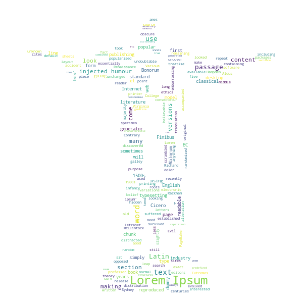

# Wordcloud

- Run `pip install -r requirements.txt`
- Run `python src/main {{path_to_words.txt -> REQUIRED}} {{mask.(png|jpeg|jpg) -> OPTIONAL}}`

**Example with mask** -> "`python3 src/main.py ./src/words.txt ./src/51Y2YwQarBL.jpg`"

